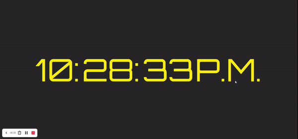

# Digital-Clock-Js

## Welcome! 👋

Thanks to visit my Github! In this project, i used "Date()" from JavaScript. This project is created with HTML, CSS and JavaScript. Here is the link for this project https://omer-yagci.github.io/Digital-Clock-Js/

**To do this project, i used basic HTML, CSS and JavaScript.**

## The challenge

Users should be able to:

- View the Digital Clock
